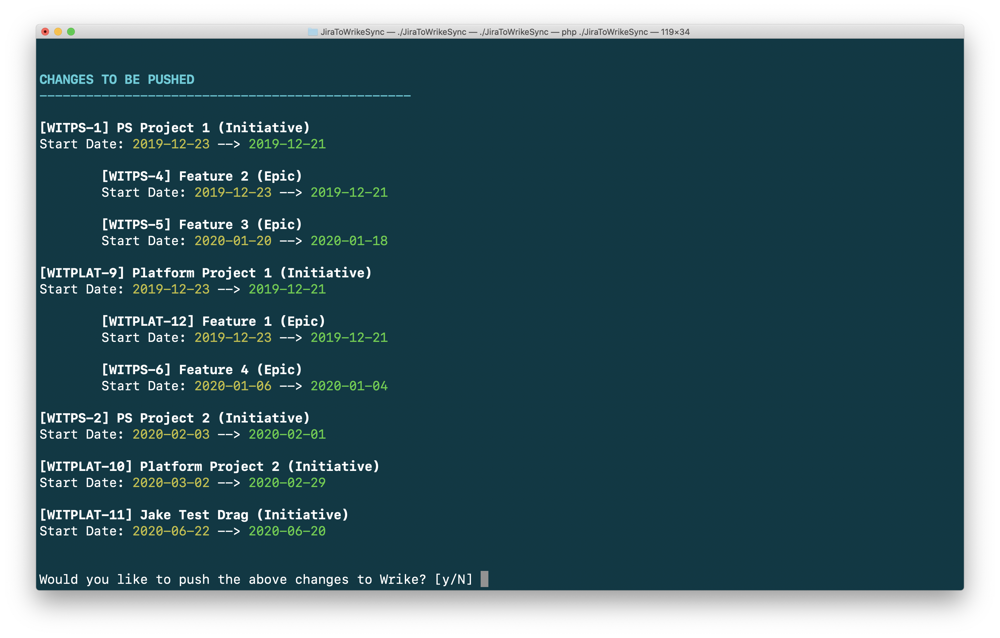

# JiraToWrikeSync

This command-line tool takes a schedule CSV generated from Jira Portfolio and updates all corresponding Wrike tasks under a given parent folder.

## Setup

1. Download and unzip or clone this repository to your local machine.

2. Open the "Terminal" application and navigate to the repository directory.

3. Install Composer by following the directions [here](https://getcomposer.org/download/).

4. Install dependencies by running `php composer.phar install`.

5. Create a `.env` file by copying the example and editing it: `cp .env.example .env`.
    - `WRIKE_ACCESS_TOKEN`: your user's permanent Wrike API access token; instructions to create one are [here](https://help.wrike.com/hc/en-us/community/posts/211849065-Get-Started-with-Wrike-s-API).
    - `WRIKE_PARENT_FOLDER`: the ID of the folder whose tasks you want to sync with Jira. You can get the ID of the folder by running the following command: `curl -g -X GET -H 'Authorization: bearer [your_access_token]' 'https://www.wrike.com/api/v4/folders'`. Search the output (Cmd+F) for the "title" attribute of the folder. The "id" attribute of the same node is what you want.
    - You can optionally configure numerous other settings if desired:
        - `JIRA_SCHEDULE_FILE`: path to the Jira Portfolio schedule CSV; default: `./schedule.csv`
        - `JIRA_KEY_FIELD`: Schedule CSV key column header; default: `Issue key`
        - `JIRA_TITLE_FIELD`: Schedule CSV title column header; default: `Title`
        - `JIRA_TYPE_FIELD`: Schedule CSV type column header; default: `Hierarchy`
        - `JIRA_PARENT_FIELD`: Schedule CSV parent column header; default: `Parent`
        - `JIRA_START_FIELD`: Schedule CSV scheduled start date column header; default: `Scheduled start`
        - `JIRA_END_FIELD`: Schedule CSV scheduled end date column header; default: `Scheduled end`
        - `JIRA_TEAM_FIELD`: Schedule CSV team column header; default: `Teams`
        - `WRIKE_JIRA_KEY_FIELD`: Wrike Jira key custom field ID; default: `IEAAXCISJUABFJSX` (Jira Key)
        - `WRIKE_TEAM_FIELD`: Wrike Jira team custom field ID; default: `IEAAXCISJUABFGZA` (Assigned Team)
        
6. Make the script executable by running `chmod +x JiraToWrikeSync`.
        
## Usage

In order to import the schedule from Jira, you must first export a CSV from an instance of Jira Portfolio.

1. Go to the source Jira Portfolio instance.

2. Click on "Reports" in the top right.

3. Click on "Switch reports" in the upper left and select "Scope".

4. Click on the "Export" button in the upper right.


A CSV file will download. Now rename and move the file to the path specified by the `JIRA_SCHEDULE_FILE` option. The default location is 'schedule.csv' in the repository directory.

Run the script from anywhere: `path/to/repository/JiraToWrikeSync`. It should work without adding any arguments so long as the `WRIKE_ACCESS_TOKEN` and `WRIKE_PARENT_FOLDER` options are configured in `.env`. However, you may pass in the following arguments at runtime:
    
- `--token` (`-t`): your Wrike access token
- `--folder` (`-f`): the parent folder ID
- `--csv` (`-c`): the path to the schedule CSV

For example, you can pass in all 3 like so:

```
path/to/repository/JiraToWrikeSync -t "[your_access_token]" -f "[your_wrike_folder_id]" -c "[path_to_schedule_csv]"
```

By default, the script will display all changes that will be made and prompt you to confirm whether you'd like to proceed. This way you will have a chance to abort the update if something doesn't look right. However, if you wish to skip the confirmation and automatically push the changes, you may pass the `--push` (`-p`) flag.



If you wish to see more detail or to debug, you may also add a `--verbose` (`-v`) flag.

## Notes & Caveats

- A corresponding Wrike task with a custom field to hold the Jira issue key must be created for every synced item. By default, this custom field is the 'Jira Key' custom field, but another custom field could be created and used so long as the `WRIKE_JIRA_KEY_FIELD` is updated in `.env` accordingly. **This must be done in order for the script to know which Wrike tasks correspond to which Jira issues.**

- To automate the creation of Jira issues when a task is created in Wrike and vice versa, a synchronization integration may be enabled. This synchronization can automatically set the 'Jira Key' custom field such that no manual linking is required. However, there are some pitfalls to avoid when doing so. Contact the author for more information.

- By default, the Jira team is synced to Wrike using the 'Assigned Team' custom field. However, this can be changed to another custom field by setting the `WRIKE_TEAM_FIELD`.

- Jira scheduled start and end dates are automatically translated in Wrike based on the rules set up therein. Since Jira has no knowledge of Wrike's rules, and vice versa, this could result in Wrike never updating to the precise dates provided by Jira. Therefore, the script will continue to attempt to update the dates in Wrike as they will never be updated to match those in Jira. There's no real harm in this, but it might appear weird at first.

